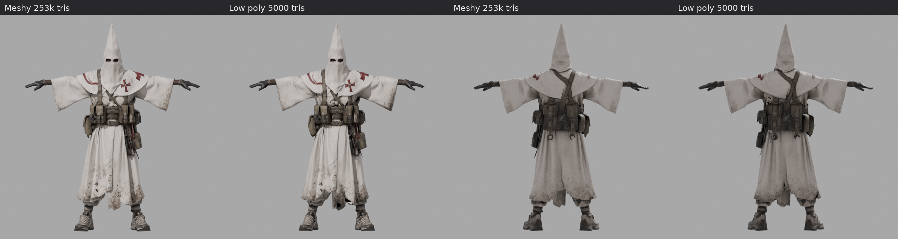
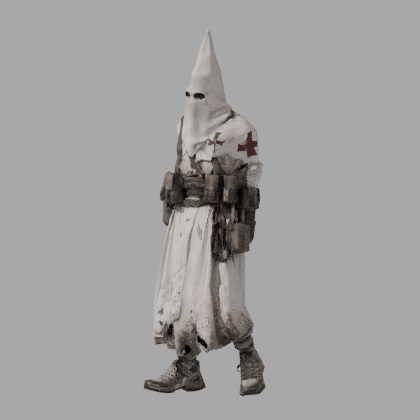

# The Forsaken Zealot, игровая лоуполи версия

## Характеристики

- 5000 треугольников (исходник Meshy: 253 062)
- 2836 вершин в Blender, около 6080 в движке (с учетом UV-швов)
- Рост 1.90 м по кончику капюшона. Голова внутри капюшона на высоте около 1.70 м, глаза 1.575 м
- Скелет Mixamo: 65 костей `mixamorig:*`, те же имена, иерархия и ориентации, что в Standard_Walk.fbx (расхождение ориентаций 0.0000°)
- До 4 костей на вершину, веса нормализованы
- Один материал, одна UV, текстуры 2048x2048
- Персонаж смотрит в -Y в Blender (+Z в Unity), стопы на нуле, T-поза

## Файлы

| Файл | Что внутри |
|---|---|
| `Zealot.fbx` | Модель + скелет в T-позе, без анимации, текстуры встроены. Основной файл для Unity и Unreal |
| `Zealot_Walk.fbx` | То же самое с анимацией ходьбы из твоего Standard_Walk.fbx, для проверки |
| `Zealot.glb` | glTF: модель, скелет, PBR-материал (base color, normal, ORM) и ходьба. Для Godot, three.js, Blender |
| `Zealot.blend` | Исходник Blender 5.2 с упакованными текстурами |
| `textures/Zealot_BaseColor.png` | Цвет (sRGB) |
| `textures/Zealot_Normal_OpenGL.png` | Карта нормалей, Y+ (Unity, Godot, Blender) |
| `textures/Zealot_Normal_DirectX.png` | Карта нормалей, Y- (Unreal) |
| `textures/Zealot_ORM.png` | R = AO, G = Roughness, B = Metallic (Unreal, glTF) |
| `textures/Zealot_MetallicSmoothness.png` | RGB = Metallic, A = Smoothness (Unity Standard/URP Lit) |
| `textures/Zealot_AO.png` | Ambient occlusion отдельно |
| `previews/` | Сравнение с исходником, сетка, гифка ходьбы, стресс-тест поз |

## Импорт

Unity:
1. Перетащить `Zealot.fbx`. Rig > Animation Type: Humanoid, Avatar: Create From This Model.
2. Анимации Mixamo (FBX "Without Skin") тоже ставить в Humanoid. Тогда любая анимация Mixamo ложится без настройки.
3. Материал URP Lit: Base Map = BaseColor, Normal Map = Normal_OpenGL, Metallic Map = MetallicSmoothness (Source: Metallic Alpha), Occlusion = AO.

Unreal:
1. Импортировать `Zealot.fbx` как Skeletal Mesh. Узел `Armature` Unreal убирает сам.
2. Normal_DirectX в слот нормалей, ORM с выключенным sRGB: R в Ambient Occlusion, G в Roughness, B в Metallic.
3. Для анимаций Mixamo: IK Retargeter, или импорт анимаций прямо на этот скелет (имена костей совпадают).

Godot 4:
1. Взять `Zealot.glb`, материал и ходьба уже внутри.
2. Для чужих анимаций Mixamo: Skeleton3D > Retarget > BoneMap с профилем SkeletonProfileHumanoid.

## Что сделано

1. Нормализация: стопы на нуле, высота 1.90 м, центр между стопами.
2. Вырезана невидимая изнанка: Meshy отдал робу, капюшон и рукава как полые оболочки с внутренними стенками. Изнанку, которую не видно снаружи, убрал до децимации (у прорезей, подола и рукавов оставлена полоса 2 см). Так весь бюджет ушел на видимую поверхность.
3. Сглаживание Таубина без усадки, чтобы мелкие складки ткани ушли в normal map, а не в геометрию.
4. Децимация до 5000 с приоритетом зон: кисти, ступни и прорези глаз получили больше треугольников.
5. Исправлены вывернутые треугольники после децимации (проверка лучами снаружи), тонкие складки, видимые с обеих сторон, сделаны двусторонними за счет невидимых треугольников внутри робы. Дыр при отсечении задних граней нет ни в T-позе, ни в ходьбе.
6. UV через xatlas, квадратный атлас 2048, плотность на кистях и лице повышена в 1.35 раза.
7. Запекание с хайполи в Cycles: base color, normal (с учетом исходной normal map Meshy), roughness, metallic, AO.
8. Скелет взят из Standard_Walk.fbx. Ориентации и roll всех костей оставлены как у Mixamo, сдвинуты только позиции суставов под пропорции модели. Поэтому анимации Mixamo проигрываются и через Humanoid-ретаргет, и напрямую по именам костей.
9. Веса: автоматические по теплу костей, затем ручная логика. Капюшон жестко на голове. Подол робы на Hips и бедрах с плавным переходом от пояса к низу, чтобы роба не рвалась между ногами при шаге. Торс и разгрузка не цепляются за руки. Максимум 4 влияния.
10. Проверка: экспортированный FBX импортирован в пустую сцену, на него надета оригинальная анимация Mixamo. Плюс стресс-тест поз (руки вверх, присед, скрутка, мах ногой).

## Пересборка

Скрипты в `../pipeline`, порядок в `run.sh`. Нужны Python 3.13 и `pip install bpy==5.2.2 numpy pillow xatlas`.
