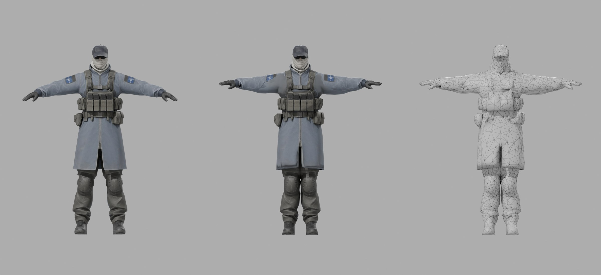
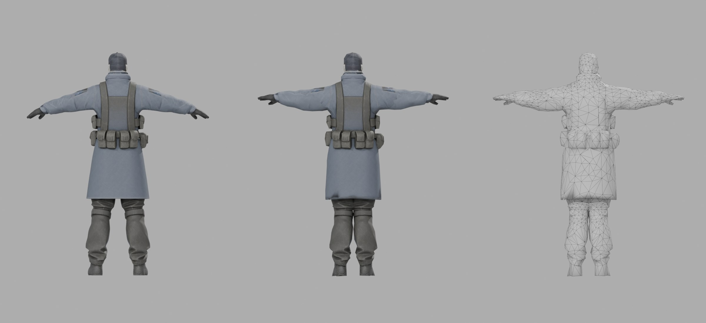
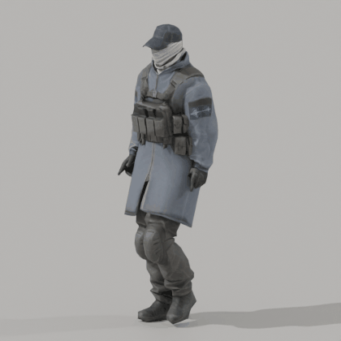

# Arctic Sentinel, low poly под Mixamo

Исходник: модель из Meshy AI на 148 486 треугольника. Результат: 4 982 треугольников, PBR текстуры 2048, скелет Mixamo.





Слева направо: оригинал Meshy, low poly, сетка low poly.

## Файлы

| Файл | Что внутри |
|---|---|
| `Sentinel_LowPoly.fbx` | модель в T-позе, скелет Mixamo, веса, текстуры вшиты. Основной файл для движка и для загрузки в Mixamo |
| `Sentinel_Walk.fbx` | то же + анимация Standard Walk (36 кадров, 30 fps) |
| `Sentinel.glb` | glTF: модель, скелет, ходьба, все PBR карты (BaseColor, Normal, ORM). Для Godot, three.js, просмотрщиков |
| `Sentinel.blend` | сцена Blender, текстуры берутся из `textures/` |
| `textures/T_Sentinel_BaseColor.png` | цвет, sRGB |
| `textures/T_Sentinel_Normal.png` | нормали OpenGL (Unity, Godot, Blender) |
| `textures/T_Sentinel_Normal_DirectX.png` | нормали DirectX (Unreal) |
| `textures/T_Sentinel_ORM.png` | R = AO, G = Roughness, B = Metallic (glTF, Unreal) |
| `textures/T_Sentinel_MetallicSmoothness.png` | RGB = Metallic, A = Smoothness (Unity Standard/URP) |

## Характеристики

- 4 982 треугольников, 2 433 вершины (3 463 на GPU с учетом швов UV)
- 1 материал, 1 UV канал, 117 островов, плотность ~700 px/м, голове дано в 1.45 раза больше
- 65 костей `mixamorig:*`: имена, иерархия и rest-ориентации совпадают с Mixamo (расхождение 0.000°), суставы подогнаны под пропорции модели
- до 4 костей на вершину, веса нормализованы
- рост 1.91 м, стопы на нуле, лицо смотрит вперед (-Y в Blender, +Z в Unity)

## Что сделано

1. Декимация с весами по зонам: больше полигонов на лицо, кисти, локти, колени, плечи. Меньше на подсумки и сандалии, их детали ушли в normal map.
2. UV развертка по частям тела (голова, торс, руки, кисти, шорты, голени, стопы), швы в скрытых местах, острова с растяжением дорезаны.
3. Запекание с хайпольки: цвет, нормали, roughness, metallic, AO. Запекание в 4096 с даунсэмплом до 2048.
4. Риг: скелет Mixamo из `Standard_Walk.fbx`, автоматические веса, сглаживание.
5. Руки подняты до горизонтали, ноги выпрямлены под bind-позу Mixamo. Модель Meshy стояла с опущенными на ~10-24° руками (A-поза) и расставленными ногами, без этого руки входили бы в торс в анимациях.
6. Проверка: ходьба, присед, сжатый кулак, руки вверх.

## Как подключить

Unity: импортировать `Sentinel_LowPoly.fbx`, Rig > Animation Type: Humanoid. Анимации Mixamo тоже ставить на Humanoid. Материал: Albedo = BaseColor, Normal Map = Normal, Metallic = MetallicSmoothness (Source: Metallic Alpha), Occlusion = ORM.

Unreal: импорт FBX как Skeletal Mesh, нормали брать `Normal_DirectX`, ORM в один сэмплер (R AO, G Roughness, B Metallic). Анимации Mixamo импортировать на этот же скелет.

Godot: `Sentinel.glb`, все карты уже подключены. Анимации Mixamo совпадают по именам костей.

Mixamo: анимации, скачанные для стандартного персонажа (Without Skin), ложатся напрямую. Rest-ориентации костей те же, поэтому повороты переносятся 1 в 1.

## Пересборка

Скрипты в `../tools/lowpoly_pipeline/`, нужен Blender 5.2 как модуль (`pip install bpy==5.2.2 xatlas pillow numpy`):

```
JOINTS=joints_sentinel PY=python ./run_all.sh Meshy.glb Standard_Walk.fbx work out
```

Координаты суставов в `joints_sentinel.py` и зоны в `s2_decimate.py`/`s3_uv.py` подобраны под эту модель.
