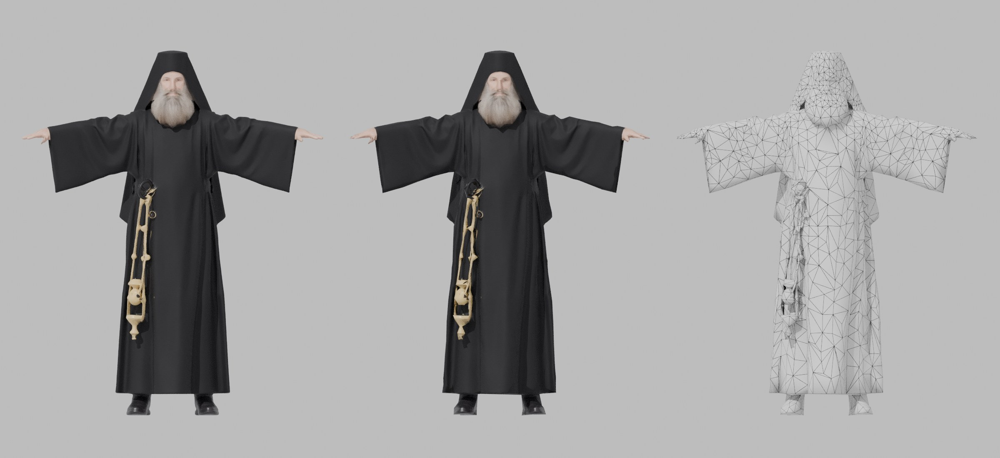
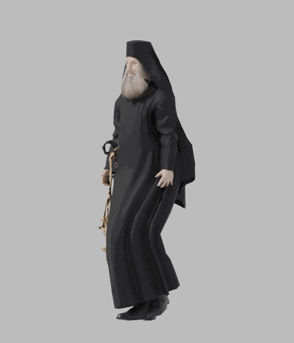

# Black Robed Monk, low poly под Mixamo

Исходник: модель из Meshy AI на 145 020 треугольников. Результат: 4 976 треугольников, PBR текстуры 2048, скелет Mixamo.





Слева направо: оригинал Meshy, low poly, сетка low poly.

## Файлы

| Файл | Что внутри |
|---|---|
| `Monk_LowPoly.fbx` | T-поза, скелет Mixamo, веса, текстуры вшиты. Основной файл для движка и Mixamo |
| `Monk_Walk.fbx` | то же + анимация Walk (36 кадров, 30 fps) |
| `Monk.glb` | glTF: модель, скелет, ходьба, BaseColor, Normal, ORM |
| `Monk.blend` | сцена Blender |
| `textures/` | BaseColor, Normal (OpenGL), Normal_DirectX, ORM, MetallicSmoothness |

## Характеристики

- 4 976 треугольников, 2 452 вершины, 1 материал
- 65 костей `mixamorig:*`, rest-ориентации совпадают с Mixamo (0.000°)
- до 4 костей на вершину, веса нормализованы
- рост 1.90 м, стопы на нуле, лицо смотрит вперед

## Что сделано

1. Декимация с весами: больше полигонов на лицо с бородой, кисти, запястья, плечи. Ряса и кадило упрощены, складки и цепочки ушли в normal map.
2. UV развертка, запекание цвета, нормалей, roughness, metallic, AO с хайпольки.
3. Скелет Mixamo подогнан под монаха: руки горизонтально, кисти выходят из рукавов, ноги под рясой.
4. Проверено на ходьбе Mixamo: ряса идет за ногами без разрывов, рукава не входят в тело.

Кадило привязано к ногам и бедру, в ходьбе качается вместе с рясой. Если нужно отдельное качание, его лучше вынести в отдельную кость или физику в движке.

## Пересборка

```
NAME=Monk JOINTS=joints_monk PY=python ./run_all.sh Meshy.glb ../../combat_medic/Medic_Walk.fbx work out
```
(в run_all.sh для монаха использовался boost `head 0.3, hands 0.3, wrists 0.2, elbows 0.15, shoulders 0.15, knees 0, shins 0, feet -0.1`)
