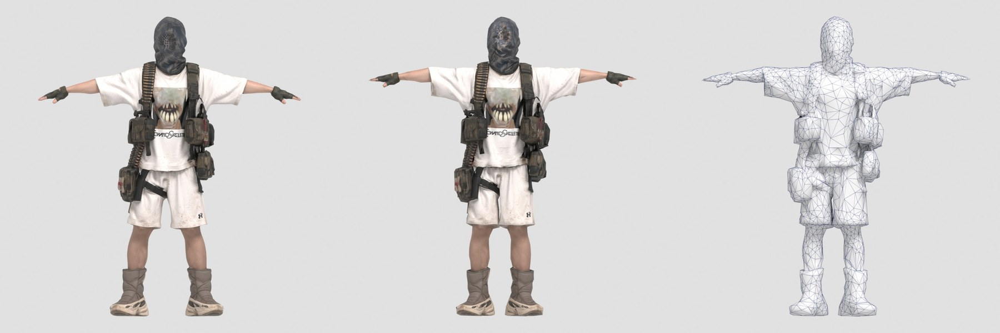
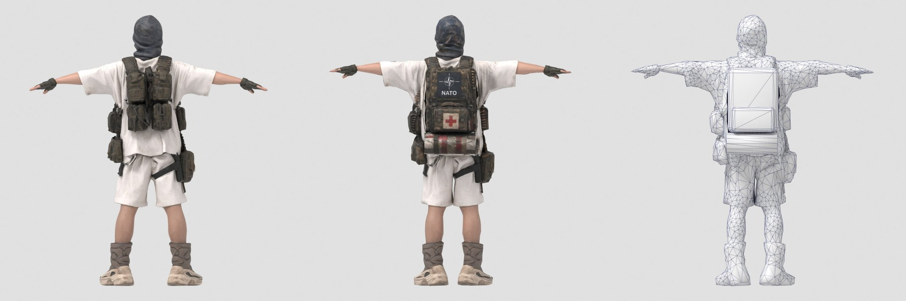
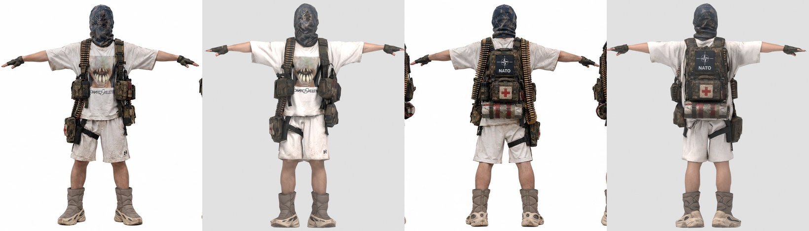
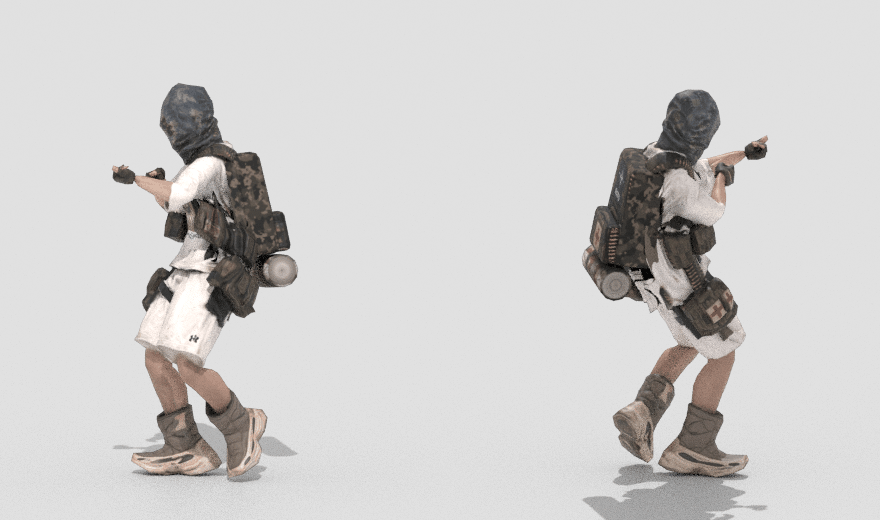

# Masked Arsenal, low poly под Mixamo

Исходник: модель из Meshy AI на 160 558 треугольников. Результат: 4 993 треугольника, рост 1.80 м, PBR текстуры 2048, скелет Mixamo.




Слева направо: оригинал Meshy, low poly, сетка low poly.



Референс и low poly в одном масштабе: перед, перед, спина, спина.



## Файлы

| Файл | Что внутри |
|---|---|
| `MaskedArsenal_LowPoly.fbx` | модель в T-позе, скелет Mixamo, веса, текстуры вшиты. Основной файл для движка и для Mixamo |
| `MaskedArsenal_Walk.fbx` | то же + анимация Walking из присланного файла (42 кадра, 30 fps) |
| `MaskedArsenal.glb` | glTF: модель, скелет, ходьба, все PBR карты (BaseColor, Normal, ORM). Для Godot, three.js, просмотрщиков |
| `MaskedArsenal.blend` | сцена Blender, текстуры берутся из `textures/` |
| `textures/T_MaskedArsenal_BaseColor.png` | цвет, sRGB |
| `textures/T_MaskedArsenal_Normal.png` | нормали OpenGL (Unity, Godot, Blender) |
| `textures/T_MaskedArsenal_Normal_DirectX.png` | нормали DirectX (Unreal) |
| `textures/T_MaskedArsenal_ORM.png` | R = AO, G = Roughness, B = Metallic (glTF, Unreal) |
| `textures/T_MaskedArsenal_MetallicSmoothness.png` | RGB = Metallic, A = Smoothness (Unity Standard/URP) |

## Характеристики

- 4 993 треугольника: 4 817 тело и снаряжение, 176 рюкзак, аптечка и скатка
- 2 529 вершин (3 202 на GPU с учетом швов UV)
- 1 материал, 1 UV канал, 57 островов, плотность ~770 px/м, голове дано в 1.4 раза больше, рюкзаку с патчем NATO в 1.3
- 65 костей `mixamorig:*`: имена, иерархия и rest-ориентации совпадают с Mixamo (расхождение 0.000°)
- Hips на высоте 1.045 м, у Mixamo 1.043 м. Абсолютные кривые бедер из анимаций Mixamo ставят ботинки на землю
- до 4 костей на вершину, веса нормализованы
- рост 1.80 м, подошвы на нуле, лицо смотрит вперед (-Y в Blender, +Z в Unity)

## Что сделано

1. Масштаб до 1.80 м, модель по центру, подошвы на нуле.
2. Спина по референсу. У Meshy на спине была сетка из 4 подсумков вместо рюкзака. Добавил рюкзак, подсумок аптечки и скатку (176 треугольников), спрятанные под ними подсумки Meshy удалил из low poly и из хайполи для запекания.
3. Декимация с весами по зонам: больше полигонов на кисти, локти, плечи, колени. Меньше на подошвы, их рисунок ушел в normal map.
4. UV развертка по частям тела, швы в скрытых местах.
5. Запекание с хайполи в 4096 с даунсэмплом до 2048: цвет, нормали, roughness, metallic, AO.
6. Проекция референса на текстуру с подгонкой по силуэту и оптическому потоку:
   - рюкзак: патч NATO, аптечка с красным крестом, скатка с красными ремнями, пулеметные ленты по краям рюкзака. Пропорции патча сохранены, боковины рюкзака закрашены камуфляжем в палитре рюкзака с референса
   - маска: камуфляж, перфорация и прожженные пулевые отверстия с 4 крупных планов
   - спина футболки: ремни и ленты с вида сзади
   - перед оставлен от Meshy: он четче референса (у референса ~375 px/м против 770 px/м у текстуры)
7. Рельеф деталей с референса добавлен в normal map: дырки на маске утоплены, патроны и ремни выпуклые. Латунь патронов получила metallic 0.75 и roughness 0.38.
8. Риг: скелет Mixamo из `Walking.fbx`, автоматические веса, сглаживание, рюкзак и скатка жестко привязаны к позвоночнику.
9. Руки подняты до горизонтали (в исходнике опущены на ~9°), ноги выпрямлены (были разведены на ~8°). Оставил разворот ног 2°, иначе широкие ботинки цепляют друг друга в ходьбе. Минимальный зазор между ботинками за цикл ходьбы 9 мм.
10. Проверка: ходьба, руки вниз со сжатым кулаком, присед с поднятыми руками (`previews/deformation_test.jpg`).

## Как подключить

Unity: импортировать `MaskedArsenal_LowPoly.fbx`, Rig > Animation Type: Humanoid. Анимации Mixamo тоже ставить на Humanoid. Материал: Albedo = BaseColor, Normal Map = Normal, Metallic = MetallicSmoothness (Source: Metallic Alpha), Occlusion = ORM.

Unreal: импорт FBX как Skeletal Mesh, нормали брать `Normal_DirectX`, ORM в один сэмплер (R AO, G Roughness, B Metallic). Анимации Mixamo импортировать на этот же скелет.

Godot: `MaskedArsenal.glb`, все карты уже подключены. Анимации Mixamo совпадают по именам костей.

Mixamo: анимации, скачанные для стандартного персонажа (Without Skin), ложатся напрямую. Rest-ориентации костей те же, поэтому повороты переносятся 1 в 1, а высота бедер совпадает с Mixamo.

## Ограничения

- Пальцы у исходника слиплись в варежку. Кулак и хват работают, отдельные пальцы гнутся вместе с соседями.
- Подошва ботинка длиннее стопы Mixamo. В момент отрыва носка она уходит в пол до 3 см на 2-3 кадра, в опоре висит над полом до 1 см.

## Пересборка

Скрипты в `../tools/masked_arsenal/`, нужен Blender 5.2 как модуль (`pip install bpy==5.2.2 xatlas pillow numpy scipy opencv-python-headless`):

```
PY=python ./run_all.sh Meshy.glb Walking.fbx reference.png work out
```

Координаты суставов в `joints.py`, геометрия рюкзака и прямоугольники на референсе в `gear.py`, зоны декимации в `s2_decimate.py`.
