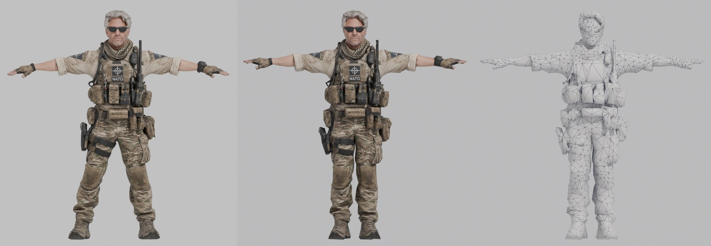
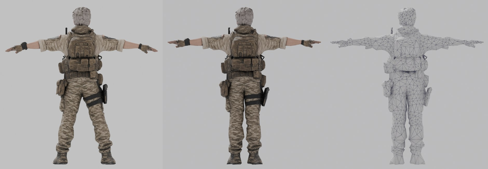
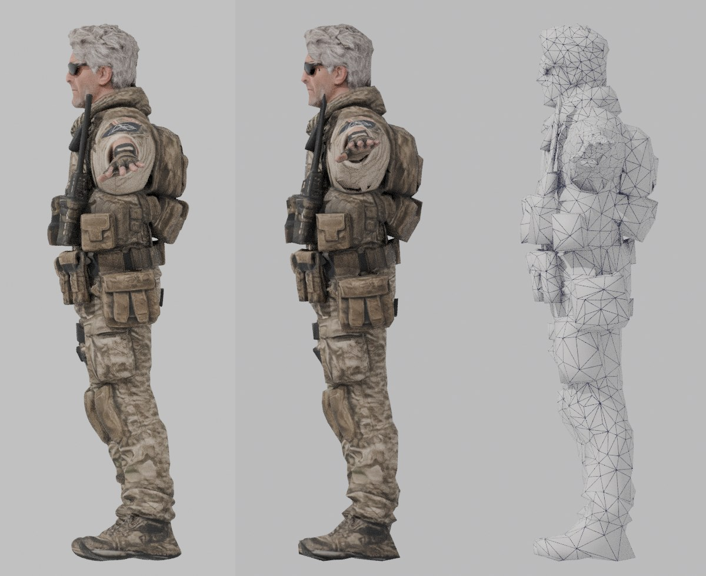
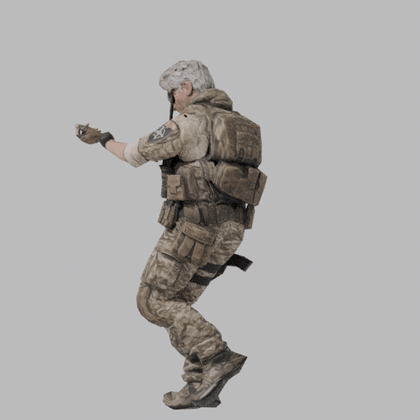
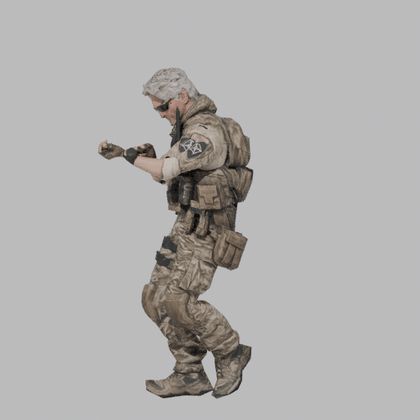
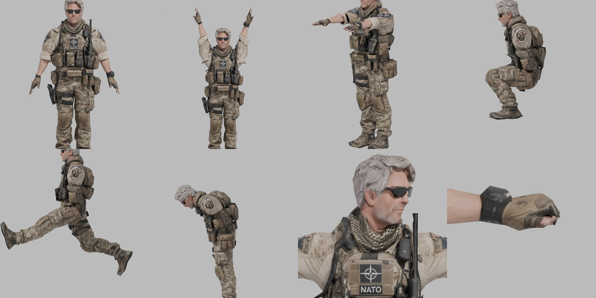

# NATO Soldier, low poly под Mixamo

Исходник: модель из Meshy AI на 175 938 треугольников. Результат: 5 000 треугольников, рост 1.83 м, PBR текстуры 2048, скелет Mixamo, проверено на анимации Walking.





Слева направо: оригинал Meshy (масштаб 1.83 м), low poly, сетка low poly. У low poly ноги выпрямлены и руки подняты до горизонтали, это bind-поза Mixamo.

 



Тесты деформаций: руки вниз, руки вверх, руки вперед, присед, мах ногой, наклон, поворот головы, кулак.

## Файлы

| Файл | Что внутри |
|---|---|
| `Soldier.fbx` | модель в T-позе, скелет Mixamo, веса, текстуры вшиты. Основной файл для движка и для загрузки в Mixamo |
| `Soldier_Walk.fbx` | то же + твоя анимация Walking (42 кадра, 30 fps, с перемещением вперед) |
| `Soldier.glb` | glTF: модель, скелет, ходьба, все PBR карты (BaseColor, Normal, ORM). Для Godot, three.js, просмотрщиков |
| `Soldier.blend` | сцена Blender, текстуры берутся из `textures/` |
| `textures/T_Soldier_BaseColor.png` | цвет, sRGB |
| `textures/T_Soldier_Normal.png` | нормали OpenGL (Unity, Godot, Blender) |
| `textures/T_Soldier_Normal_DirectX.png` | нормали DirectX (Unreal) |
| `textures/T_Soldier_ORM.png` | R = AO, G = Roughness, B = Metallic (glTF, Unreal) |
| `textures/T_Soldier_MetallicSmoothness.png` | RGB = Metallic, A = Smoothness (Unity Standard/URP) |

## Характеристики

- 5 000 треугольников, 2 392 вершины (4 952 на GPU с учетом швов UV)
- среднее отклонение поверхности от оригинала 1.9 мм
- рост 1.830 м, стопы на нуле, лицо смотрит вперед (-Y в Blender, +Z в Unity)
- 1 материал, 1 UV канал, 2048x2048, ~670 px/м, голове дано в 1.5 раза больше, кистям в 1.15
- 65 костей `mixamorig:*`: имена, иерархия и rest-ориентации совпадают с Mixamo (расхождение 0.000°), суставы подогнаны под пропорции солдата
- до 4 костей на вершину, веса нормализованы, антенна рации на груди жестко привязана к `Spine2` и не гнется при поворотах головы

## Что сделано

1. Масштаб до 1.83 м. Исходник Meshy был 1.89 м.
2. Декимация 175 938 → 5 000 с весами по зонам: больше полигонов на лицо, кисти, локти, колени, плечи, таз. Меньше на ботинки. Складки ткани, швы подсумков и мелкие детали ушли в normal map.
3. UV: голова, руки и кисти развернуты крупными островами по частям тела (лицо без швов посередине), снаряжение на торсе и ногах порезано xatlas на мелкие чарты с минимальным растяжением. Средняя анизотропия текселя 1.06.
4. Запекание с оригинала: цвет, нормали, roughness, metallic, AO. Запекание в 4096 с даунсэмплом до 2048.
5. Риг: скелет Mixamo из твоего `Walking.fbx`. Суставы сняты по срезам меша, пальцы подогнаны по каждому пальцу отдельно (у Meshy они растопырены веером и опущены на 17°). Веса через bone heat, сглаживание.
6. Bind-поза Mixamo: руки подняты до горизонтали, кисти и пальцы выпрямлены, ноги выпрямлены вертикально. У Meshy руки были опущены на ~5°, ноги расставлены на 9° и 12°. Без этого руки входили бы в торс, а стопы съезжали бы в анимациях.
7. Выпрямленная правая нога стала на 1 см длиннее левой, голень укорочена, чтобы обе стопы стояли на полу. Потом модель масштабирована обратно ровно в 1.83 м.
8. Walking перенесен 1 в 1 по поворотам. Смещение бедер умножено на 0.964 (бедра солдата 1.006 м, у стандартного персонажа Mixamo 1.043 м), иначе ноги висели бы в воздухе на 3.7 см. В ходьбе опорная стопа держится у пола в пределах ±1.7 см.

## Анимации Mixamo

Повороты костей переносятся 1 в 1, так как rest-ориентации совпадают с Mixamo. Отличается только высота бедер, поэтому три варианта:

1. Загрузить `Soldier.fbx` в Mixamo (Upload Character). Скелет уже в формате Mixamo, анимации скачивать для этого персонажа (FBX, Without Skin, 30 fps). Mixamo сам подгонит высоту бедер.
2. Взять анимации, скачанные для любого стандартного персонажа (Y Bot и т.п.), и прогнать через скрипт (Python с bpy, как в разделе Пересборка). Он масштабирует бедра и сохраняет FBX под этот скелет:
   ```
   python -I tools/lowpoly_pipeline/retarget_mixamo.py nato_soldier/Soldier.blend out_anims Walking.fbx Run.fbx Idle.fbx
   ```
   С флагом `--skin` в каждый FBX попадет и модель.
3. Ретаргет движка (Unity Humanoid, Unreal IK Retargeter, Godot BoneMap) делает то же самое сам.

## Как подключить

Unity: импортировать `Soldier.fbx`, Rig > Animation Type: Humanoid. Анимации Mixamo тоже ставить на Humanoid. Материал: Albedo = BaseColor, Normal Map = Normal, Metallic = MetallicSmoothness (Source: Metallic Alpha), Occlusion = ORM.

Unreal: импорт `Soldier.fbx` как Skeletal Mesh, нормали брать `Normal_DirectX`, ORM в один сэмплер (R AO, G Roughness, B Metallic). Анимации импортировать на этот же скелет (вариант 1 или 2 выше).

Godot: `Soldier.glb`, все карты уже подключены. Имена костей совпадают с Mixamo.

## Пересборка

Скрипты в `../tools/lowpoly_pipeline/`, нужен Blender 5.2 как модуль (`pip install bpy==5.2.2 xatlas pillow numpy`):

```
LP_CFG=configs/soldier.py PY=python ./run_all.sh Meshy_Soldier.glb Walking.fbx work out
```

Рост, зоны декимации, сегменты UV, суставы и пальцы для этой модели лежат в `configs/soldier.py`.
