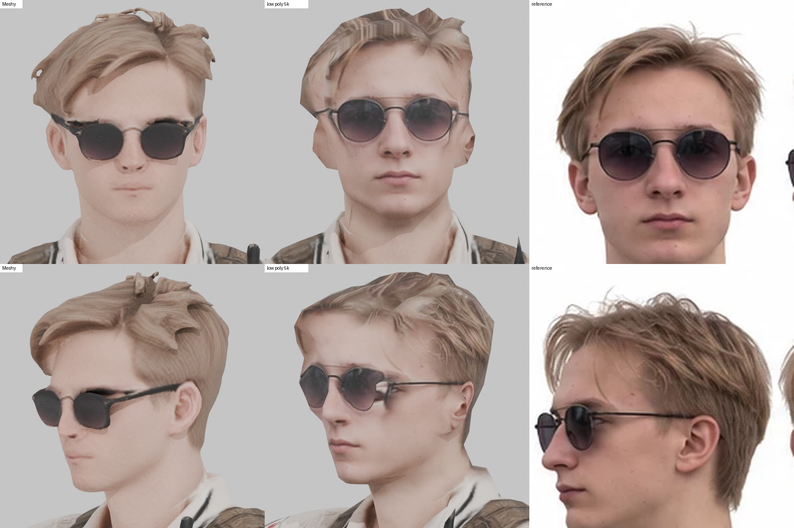
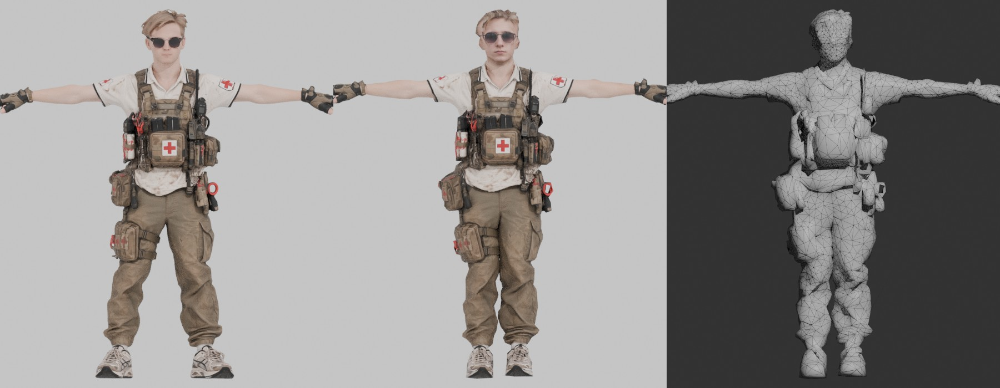
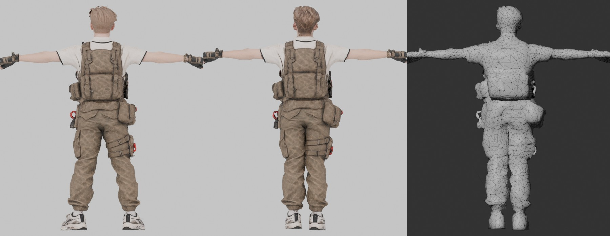
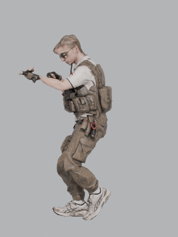

# Tactical Medic, low poly под Mixamo

Исходник: модель из Meshy AI на 145 762 треугольника. Результат: 5 000 треугольников, рост 2.00 м, PBR текстуры 2048, скелет Mixamo, лицо перенесено с референса.



Слева направо: голова Meshy, low poly, референс.





Слева направо: оригинал Meshy, low poly, сетка low poly.

## Файлы

| Файл | Что внутри |
|---|---|
| `Medic_LowPoly.fbx` | модель в T-позе, скелет Mixamo, веса, текстуры вшиты. Основной файл для движка |
| `Medic_Walk.fbx` | то же + твоя анимация Walking (42 кадра, 30 fps, с root motion) |
| `Medic.glb` | glTF: модель, скелет, ходьба, все PBR карты (BaseColor, Normal, ORM). Для Godot, three.js, просмотрщиков |
| `Medic.blend` | сцена Blender, текстуры берутся из `textures/` |
| `textures/T_Medic_BaseColor.png` | цвет, sRGB |
| `textures/T_Medic_Normal.png` | нормали OpenGL (Unity, Godot, Blender) |
| `textures/T_Medic_Normal_DirectX.png` | нормали DirectX (Unreal) |
| `textures/T_Medic_ORM.png` | R = AO, G = Roughness, B = Metallic (glTF, Unreal) |
| `textures/T_Medic_MetallicSmoothness.png` | RGB = Metallic, A = Smoothness (Unity Standard/URP) |

## Характеристики

- 5 000 треугольников, 2 464 вершины
- 1 материал, 1 UV канал, 91 остров, плотность ~800 px/м, лицу дано в 2 раза больше, остальной голове в 1.5 раза
- 65 костей `mixamorig:*`: имена, иерархия и rest-ориентации совпадают с Mixamo (расхождение 0.000°), суставы подогнаны под пропорции модели
- до 4 костей на вершину, веса нормализованы
- рост 2.00 м в T-позе, стопы на нуле, лицо смотрит вперед (-Y в Blender, +Z в Unity)

## Что сделано

1. Масштаб до 2.00 м.
2. Лицо. MediaPipe нашел по 478 точек на твоем фото и на голове Meshy. Голова перестроена 3D-морфингом по этим точкам: глаза подняты на ~2 см, лицо сужено, нижняя часть лица вытянута, уши опущены и уменьшены. Линзы очков придвинуты к лицу на 1 см, у Meshy они висели в 2.5 см от глаз.
3. Волосы. Тонкие завитки и "рога" на макушке убраны морфологией объема (opening/closing по вокселям).
4. Low poly. База собрана как воксельная поверхность хайпольки: щели за линзами, под челкой и между подсумками закрыты, тонкие кольца и ремешки ушли в текстуру. Потом декимация с весами по зонам: больше полигонов на лицо, кисти, локти, колени, плечи.
5. UV развертка по частям тела, вся передняя часть лица одним островом без швов.
6. Запекание с хайпольки: цвет, нормали, roughness, metallic, AO. Запекание в 4096 с даунсэмплом до 2048.
7. Текстура головы. На каждый тексель головы спроецированы фото с референса: спереди, оба профиля, затылок. Веса смешивания по нормалям, боковые фото не трогают лицо. Макушку не видит ни одно фото, там фактура прядей с затылка. Normal map Meshy на лице ослаблена, чтобы не спорить с новым лицом.
8. Риг: скелет Mixamo из `Walking.fbx`, суставы по замерам сечений, автоматические веса, сглаживание. Руки и ноги выпрямлены под bind-позу Mixamo, стопы развернуты носками вперед (у Meshy были развернуты наружу на 15-24°).
9. Проверка: ходьба из FBX с чистого импорта, руки вниз, присед (`previews/deformation_test.jpg`). Повороты костей в ходьбе совпадают с исходным скелетом Mixamo до 0.0°.

## Как подключить

Unity: импортировать `Medic_LowPoly.fbx`, Rig > Animation Type: Humanoid. Анимации Mixamo тоже ставить на Humanoid. Материал: Albedo = BaseColor, Normal Map = Normal, Metallic = MetallicSmoothness (Source: Metallic Alpha), Occlusion = ORM.

Unreal: импорт FBX как Skeletal Mesh, нормали брать `Normal_DirectX`, ORM в один сэмплер (R AO, G Roughness, B Metallic). Анимации Mixamo импортировать на этот же скелет.

Godot: `Medic.glb`, все карты уже подключены. Анимации Mixamo совпадают по именам костей.

Mixamo: анимации, скачанные для стандартного персонажа (Without Skin), ложатся напрямую. Rest-ориентации костей те же, поэтому повороты переносятся 1 в 1. Если анимация с root motion, а персонаж должен идти на месте, бери в Mixamo галку In Place.

## Пересборка

Скрипты в `../tools/medic_pipeline/`, нужен Blender 5.2 как модуль (`pip install bpy==5.2.2 xatlas pillow numpy scipy scikit-image`):

```
PY=python ./run_all.sh Meshy.glb reference.png Walking.fbx work out
```

Точки MediaPipe лежат в `data/`. Чтобы пересчитать их, нужен `pip install mediapipe` и модель `face_landmarker.task`, путь передается через `FACE_MODEL=...`. Координаты суставов в `joints.py`, зоны в `s2_decimate.py`/`s3_uv.py`, точки ушей и профиля в `head_landmarks.py` подобраны под эту модель и этот референс.
