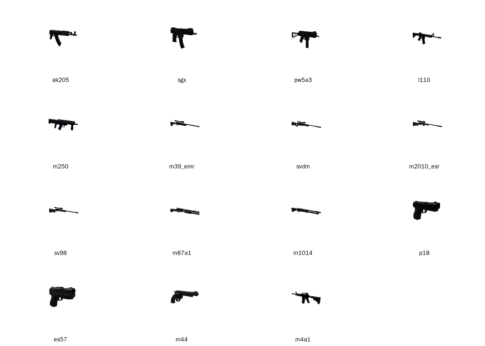

# Оружие, low poly, до 10 000 полигонов

17 моделей. Три свои из архива (M433, B36A4, M4A1) и 14 аналогов вместо BF6 моделей. Все модели меньше 10 000 треугольников.

Превью сделаны рендером из glb (poppygl), оно грубое и темное. Для проверки открой файлы в Blender или в просмотрщике glTF.

## Таблица

| Слот BF6 | Файл | Аналог | Класс | Треугольников |
|---|---|---|---|---|
| Assault Rifle, M433 | `M433.fbx` | свой, из архива | AR | 6 317 |
| Assault Rifle, B36A4 | `B36A4.fbx` | свой, из архива | AR | 6 558 |
| Carbine, M4A1 | `m4a1.glb` | свой, из архива | Carbine | 9 170 |
| Carbine, AK-205 | `ak205.glb` | AssaultRifle_3 | Carbine, средняя дистанция | 1 220 |
| SMG, SGX | `sgx.glb` | SubmachineGun_4 | Самый короткий SMG | 1 024 |
| SMG, PW5A3 | `pw5a3.glb` | SubmachineGun_2 | Длинный SMG | 1 374 |
| LMG, L110 | `l110.glb` | AssaultRifle2_1 | Массивный AR, стоит вместо LMG | 1 930 |
| LMG, M250 | `m250.glb` | Bullpup_1 | Bullpup, стоит вместо тяжелого LMG | 2 782 |
| DMR, M39 EMR | `m39_emr.glb` | SniperRifle_4 | Короткая винтовка, полуавтомат | 1 346 |
| DMR, SVDM | `svdm.glb` | SniperRifle_3 | Длинная винтовка, полуавтомат | 1 722 |
| Sniper, M2010 ESR | `m2010_esr.glb` | SniperRifle_2 | Болтовая винтовка | 1 732 |
| Sniper, SV-98 | `sv98.glb` | SniperRifle_1 | Болтовая винтовка, компактнее | 1 382 |
| Shotgun, M87A1 | `m87a1.glb` | Shotgun_1 | Помповый дробовик | 1 270 |
| Shotgun, M1014 | `m1014.glb` | Shotgun_2 | Полуавтоматический дробовик | 746 |
| Secondary, P18 | `p18.glb` | Pistol_1 | Универсальный пистолет | 1 040 |
| Secondary, ES 5.7 | `es57.glb` | Pistol_3 | Крупный пистолет | 1 442 |
| Secondary, M44 | `m44.glb` | Revolver_1 | Револьвер | 1 046 |

## Файлы

- `*.glb` и `*.fbx` - модели. Текстуры для аналогов вшиты в glb.
- `previews/overview.png` - превью всех моделей.
- `weapons_lowpoly.zip` - все файлы папки одним архивом.

## Что важно знать

- Аналоги взяты из пака Quaternius Ultimate Gun Pack (через npm пакет `@idutta2007/guns`). В README пакета указан источник quaternius.com. Паки Quaternius обычно CC0, но сам сайт я не смог открыть, поэтому лицензию нужно проверить на странице пака.
- LMG в паке нет. Вместо L110 и M250 стоят AR и bullpup, это компромисс по силуэту.
- Снайперские винтовки в паке похожи друг на друга. Различия в основном в длине и деталях прицела.
- Масштаб у моделей разный. У M433 длина примерно 39.6 единицы, у B36A4 примерно 13.6, у M4A1 примерно 18.7, у аналогов 1 до 7 единиц. Файлы из архива не менялись. При импорте в движок выставляй масштаб вручную.
- Все модели меньше 10 000 треугольников. Самая тяжелая M4A1 с 9 170.
- Модели не из BF6. Это аналоги по классу и силуэту.
